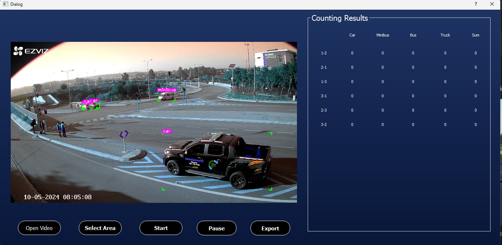
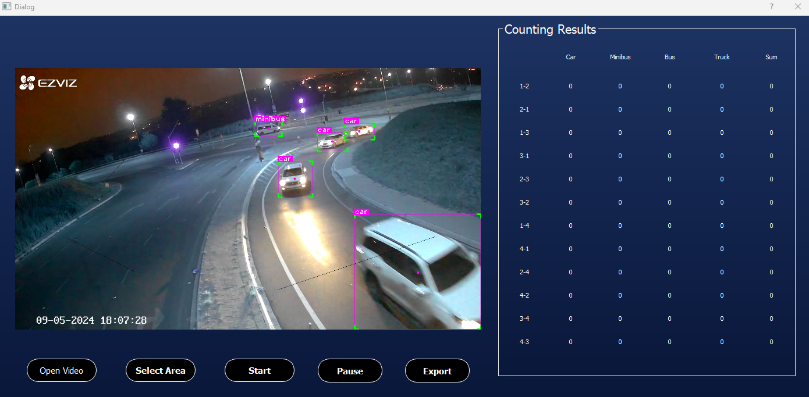

# YOLOv8-DeepSort-Object-Detection-and-Tracking
Vehicles Detection, Tracking and Counting for Car, Bus, MiniBus, Truck

---

## Steps to run Code

- Clone the repository
```
git clone https://github.com/jldev-p/Vehicle-detecting-tacking-counting.git
```
- Install the dependecies
```
pip install -r requirements.txt
```
- Go to the src folder
```
cd src
```
- Run the code
```
python .\detection.py
```
### RESULTS

<H4 align="center">
Vehicles Detection, Tracking and Counting </H4>




### Train
- Go to the train folder
```
cd train
```

- Run the code
```
python train.py
```